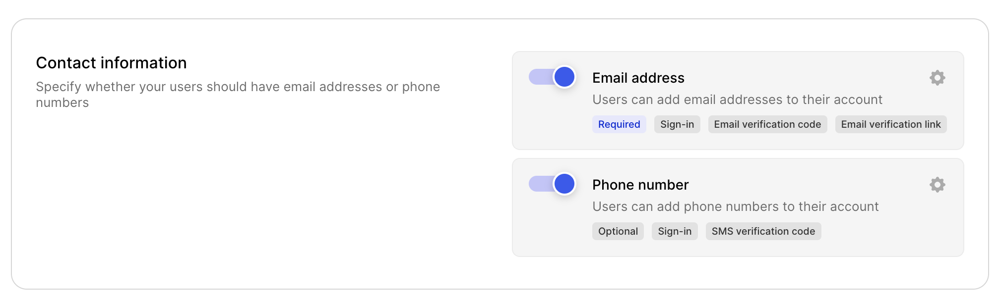
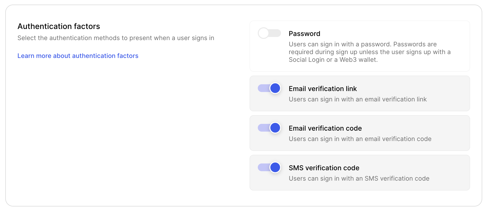
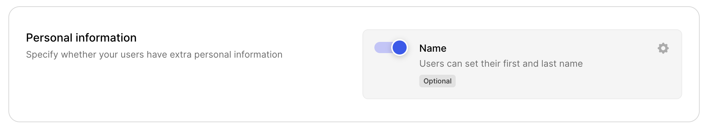
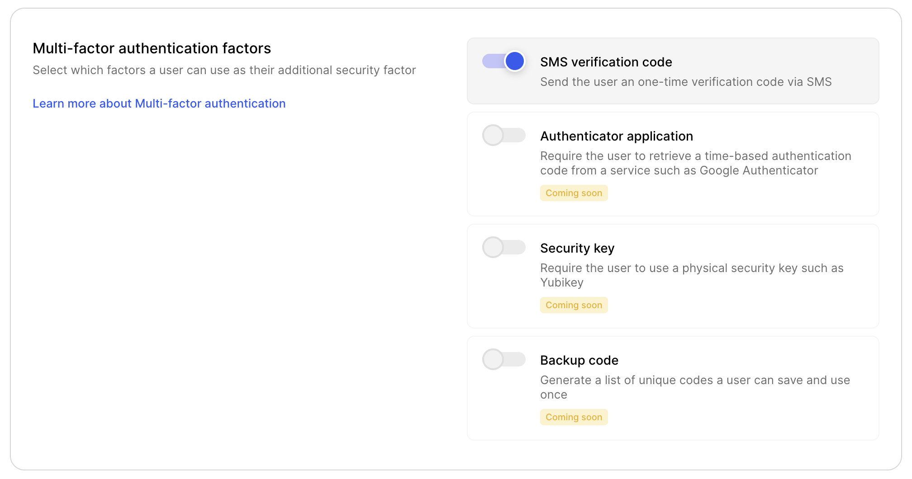

# Clerk Playground

This app will demonstrate some of the features of Clerk and different combinations that can be used to build authentication and user management flows.

## Getting started

Clone the repository to your local machine:

```sh
git clone https://github.com/clerkinc/clerk-playground.git
```

Change into the directory and install the dependendencies:

```sh
cd clerk-playground/
npm install
```

Copy the example values to a `.env.local` file:

```sh
cp .env.local.sample .env.local
```

Set the environment variables found on [API Keys](https://dashboard.clerk.dev/last-active?path=api-keys) in Clerk Dashboard:

```sh
NEXT_PUBLIC_CLERK_FRONTEND_API=your-frontend-api
CLERK_API_KEY=your-api-key
```

Then spin up the development server:

```sh
npm run dev
```

Visit http://localhost:3000 and get started!

## Setting up Clerk instance

If you want to set up your Clerk instance in the same way as this example, make sure you set the following values:

### Email, Phone, Username







### Social Login

This app has the following Social Login providers configured:

- [Google](https://clerk.dev/docs/authentication/social-login-with-google?utm_source=github&utm_medium=clerk_playground)
- [Twitter](https://clerk.dev/docs/authentication/social-login-with-twitter?utm_source=github&utm_medium=clerk_playground)
- [GitHub](https://clerk.dev/docs/authentication/social-login-with-github?utm_source=github&utm_medium=clerk_playground)

### Multi-factor



### Paths

This app has the following paths set:

| Name              | Path            |
| ----------------- | --------------- |
| Home URL          | /               |
| Sign-up URL       | /sign-up        |
| Sign-in URL       | /sign-in        |
| Sign-in Redirect  | /sign-in/verify |
| Sign-out Redirect | /sign-in        |
